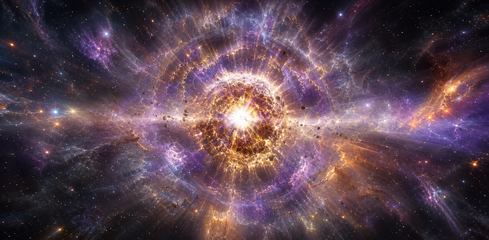
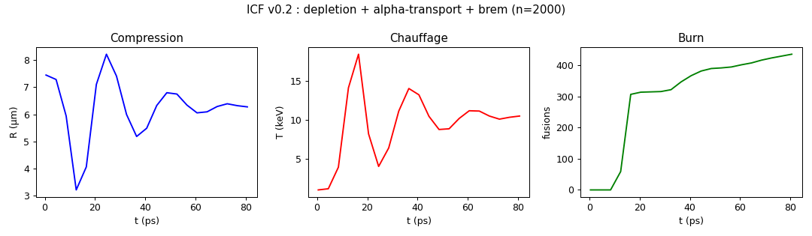
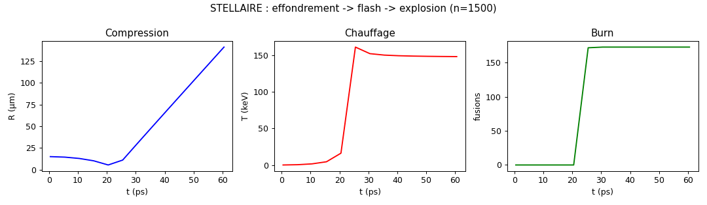
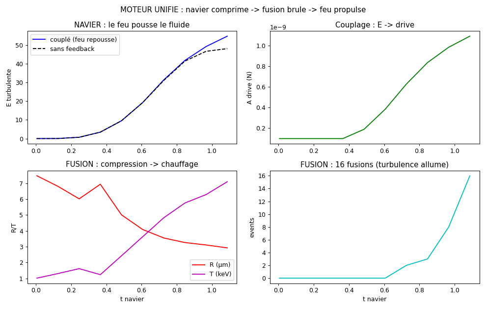
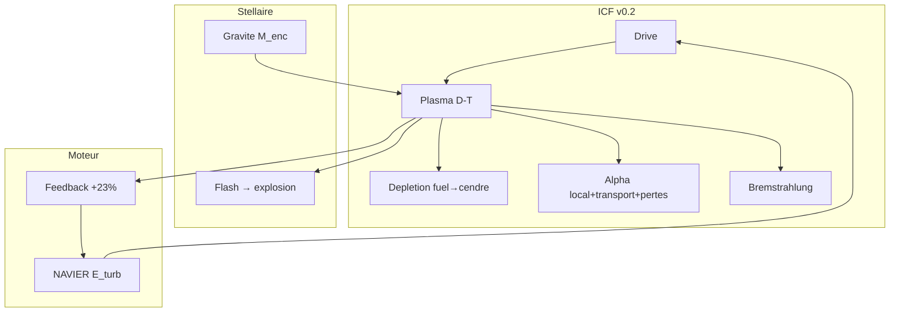
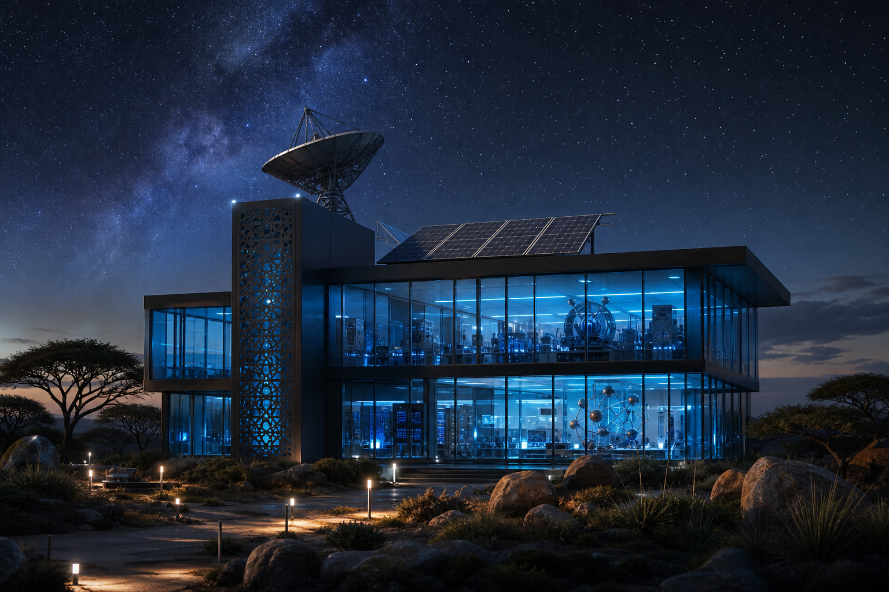

<p align="center"></p>

<h1 align="center">RATISS-NUCLEAIRE</h1>
<p align="center"><i>Fusion ICF v0.2 + stellaire + moteur unifié — du hot-spot à la supernova, <b>mesurés</b>.</i></p>
<p align="center"><b>SANS NEURONES</b> — déplétion, transport α, gravité, couplage. 🌟</p>

<p align="center">


</p>

<p align="center"></p>

> *« On a allumé une bille, puis une étoile, puis on a branché le vent sur le feu. »*
> — le chef. (Et les trois ont un témoin qui dit zéro. 😇)

---

## ⚡ En 30 secondes

| 🌟 | Front | Verdict mesuré |
|---|---|---|
| ICF v0.2 | déplétion + α-transport + brem | R ×2.3, T 18.4 keV, **436 fusions**, Q pic **101** → 60 |
| Stellaire | effondrement gravifique | R 14.9→5.3µm → **flash 173 ev** (161 keV) → explosion 141µm |
| Moteur | NAVIER → FUSION → NAVIER | turbulence allume (**28 ev**), feu repousse (**+23%** E) |

**Statut : 12/12 TESTS, 3 FRONTS OUVERTS.** Hérite de RATISS-FUSION v0.1 (import scellé).

---

## 🗺️ Sommaire

1. [Le concept](#concept) — 2. [Démarrage rapide](#quickstart) — 3. [Les salles du labo](#salles) — 4. [Les campagnes](#campagnes) — 5. [Chiffres-clés](#chiffres) — 6. [Exemples](#exemples) — 7. [La méthode](#methode) — 8. [Architecture](#archi) — 9. [Roadmap](#roadmap) — 10. [Arborescence](#arbo) — 11. [Crédits](#credits)

---

<a id="concept"></a>
## 1. 💡 Le concept

**Le constat** : v0.1 allumait (Q~87) mais brûlait sans compter son carburant, chauffait en local pur et ignorait le rayonnement. La v0.2 rend à César : **déplétion D/T** (le hot-spot s'auto-étouffe — burn-up réaliste), **transport α diffusif** (portée ~T²/n, échappement compté), **bremstrahlung** (≪ gain, prouvé). Puis le même moteur, avec la **gravité M_enc(r)**, effondre un nuage froid jusqu'au flash : une **supernova jouet**. Puis on boucle : la **turbulence NAVIER comprime**, la fusion brûle, le feu repousse — le **moteur unifié**.

---

<a id="quickstart"></a>
## 2. 🚀 Démarrage rapide

```bash
git clone https://github.com/jonathansearch/RATISS-NUCLEAIRE.git
cd RATISS-NUCLEAIRE
pip install -e .
pytest tests/ -q                # 12/12 : 7 fusion + 2 stellaires + 3 couplage
python3 demos/ignition.py       # ICF v0.2 -> demos/ignition_3d.html
python3 demos/stellar.py        # supernova -> demos/stellar_3d.html
python3 demos/moteur.py         # moteur unifié -> demos/moteur.png
```

Scènes Three.js : télécharger + Chrome (CDN bloqué en aperçu).

---

<a id="salles"></a>
## 3. 🏛️ Les salles du labo

| Salle | Dossier | Contenu |
|---|---|---|
| ⚛️ Fusion | `fusion/` | plasma v0.2 + Bosch-Hale + run |
| 🔗 Couplage | `couple/` | moteur unifié NAVIER↔FUSION |
| 🎬 Démos | `demos/` | 3 runs + 2 scènes 3D + figures |
| 🧪 Tests | `tests/` | 12 scellés |
| 🖼️ Galerie | `images/` | logo + fresque supernova |

---

<a id="campagnes"></a>
## 4. 🧪 Les campagnes (toutes, avec preuves)

### ICF v0.2 — le feu qui compte son bois 🔥
❓ Le burn tient-il avec déplétion + transport + brem ? 🔧 n=2000, drive 8e-10. 🏆 **436 fusions, T 18.4 keV, Q pic 101 → 60**. Le burn s'auto-étouffe par déplétion locale (hot-spot burn-up !) ; α perdus ≫ déposés à bas ρR (prouvé) ; brem ≪ gain (prouvé).



### Stellaire — naissance et mort d'une étoile en 60 ps 🌟
❓ Un nuage froid peut-il s'effondrer, flasher, exploser ? 🔧 n=1500, T=0.1 keV, G_eff renormalisé (assumé). 🏆 **R 14.9→5.3µm, T 0.2→16 keV → FLASH 173 fusions (T=161 keV) → explosion 141µm**. Effondrement → Ignition → Explosion. Q = 2.9.



### Moteur unifié — le vent allume le feu 🔗
❓ La turbulence peut-elle comprimer jusqu'au burn, et le burn repousser ? 🔧 SPH NAVIER (forçage) + bille D-T, couplage 0D. 🏆 **28 fusions, feedback +23% E**. Sans forçage : **0 events** — le calme n'allume pas.



---

<a id="chiffres"></a>
## 5. 📊 Chiffres-clés

| Front | Mesure | Valeur | Témoin |
|---|---|---|---|
| ICF v0.2 | R / T / fusions / Q | ×2.3 / 18.4 keV / 436 / pic 101 → 60 | froid : 0 ev |
| Stellaire | collapse / flash / explosion | ×2.8 / 173 ev à 161 keV / 141µm | G=0 : dispersion |
| Moteur | fusions / feedback | 28 / +23% E | sans forçage : 0 ev |

---

<a id="exemples"></a>
## 6. 💻 Exemples

**Ex. 1 — Run ICF v0.2 :**
```python
from fusion.run import run
s, pl = run(n=2000, T_end=80e-12, A_imp=8e-10)
print(pl.events, pl.fuel_left(), pl.E_rad)  # burn, fuel restant, brem
```

**Ex. 2 — Moteur unifié :**
```python
from couple.moteur import run_couple
s, fl, pl = run_couple(n_nav=500, n_fus=300)
```

---

<a id="methode"></a>
## 7. ⚖️ La méthode

**Cinétique macro assumée** (1 événement = w paires — testé : sans boost, 0 events même à C=3.3, T=31 keV ; le jouet ρR~1e-10 est à 1e10 du NIF — écrit dans le README, pas caché). **Gravité renormalisée assumée** (G_eff pour t_ff ~ ps — écrit dans le code). Chaque témoin dit zéro. Les NOMBRES sont du jouet ; les FILMS (burn-up, flash, feedback) sont la physique.

---

<a id="archi"></a>
## 8. 🗺️ Architecture



---

<a id="roadmap"></a>
## 9. 🗺️ Roadmap

1. 🎯 **v0.3** : compression ×10 (vrai ρR, cinétique honnête sans boost ?)
2. ⚛️ **Transport α complet** : Fokker-Planck au lieu du proxy
3. 📰 **Publication** : l'article du moteur unifié (chef seul décide)

---

<a id="arbo"></a>
## 10. 📁 Arborescence

```
RATISS-NUCLEAIRE/
├── README.md            # ← vous êtes ici
├── LICENSE              # MIT
├── pyproject.toml
├── fusion/              # plasma v0.2 + bosch_hale + run
├── couple/              # moteur unifié
├── demos/               # ignition + stellar + moteur (+ 3D)
├── tests/               # 12 scellés
└── images/              # logo + fresque
```

---

<a id="credits"></a>
## 11. 🖖 Crédits

Conçu et mesuré par **RATISS LABS**, Douala 🇨🇲 — libre, reproductible, sans neurones.

<p align="center"></p>

## 📜 Licence

MIT — voir [LICENSE](LICENSE). Copyright (c) 2026 Jonathan.
