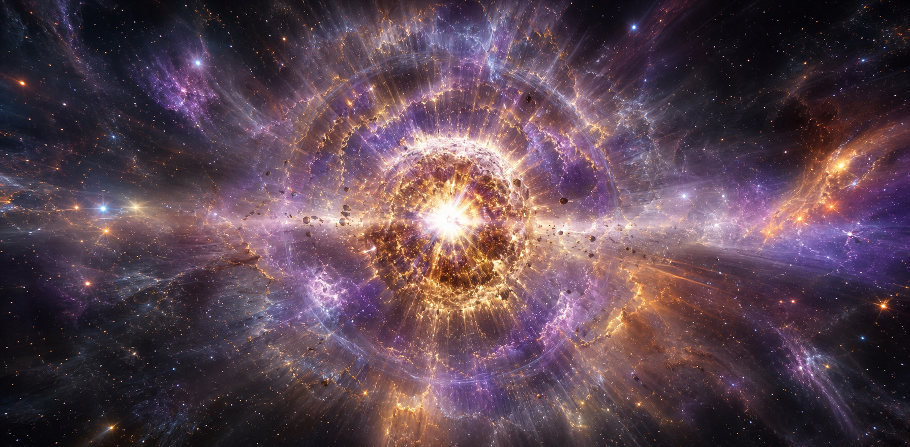
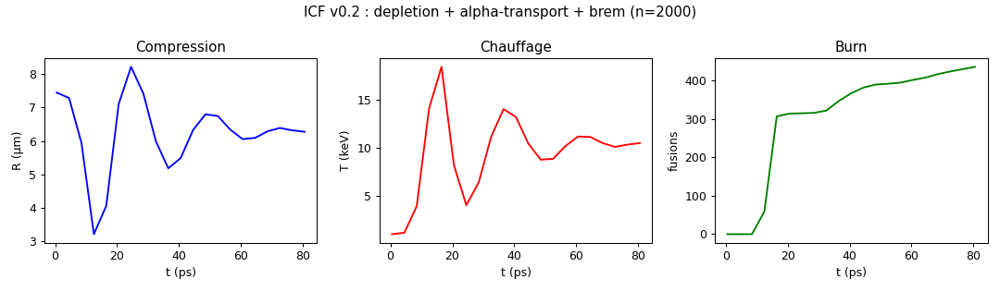
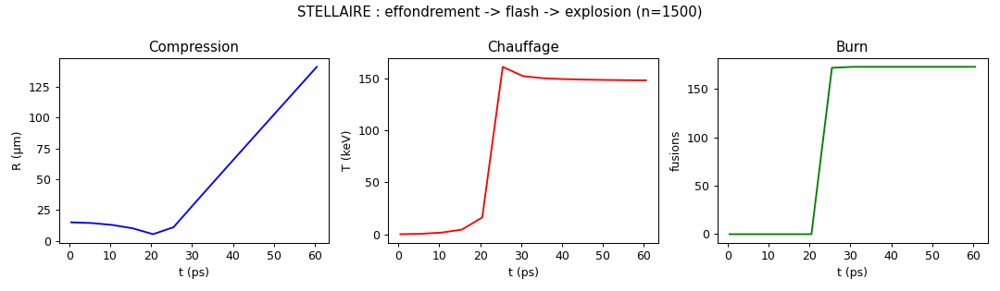
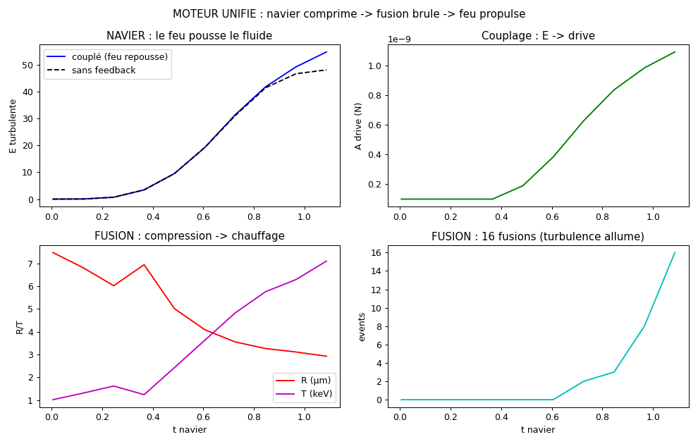
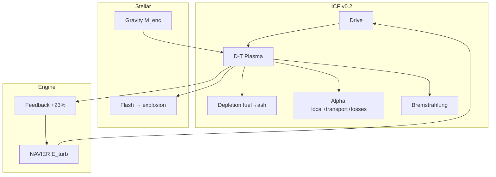

<p align="center"></p>

<h1 align="center">RATISS-NUCLEAIRE</h1>
<p align="center"><i>ICF fusion v0.2 + stellar + unified engine — from hot-spot to supernova, <b>measured</b>.</i></p>
<p align="center"><b>NO NEURONS</b> — depletion, α transport, gravity, coupling. 🌟</p>

<p align="center">


</p>

<p align="center"></p>

> *"We lit a pellet, then a star, then we plugged the wind into the fire."*
> — the chief. (And all three have a control that reads zero. 😇)

---

## ⚡ In 30 seconds

| 🌟 | Front | Measured verdict |
|---|---|---|
| ICF v0.2 | depletion + α-transport + brem | R ×2.3, T 18.4 keV, **436 fusions**, Q peak **101** → 60 |
| Stellar | gravitational collapse | R 14.9→5.3µm → **flash 173 ev** (161 keV) → explosion 141µm |
| Engine | NAVIER → FUSION → NAVIER | turbulence ignites (**28 ev**), fire pushes back (**+23%** E) |

**Status: 12/12 TESTS, 3 FRONTS OPEN.** Inherits RATISS-FUSION v0.1 (sealed import).

---

## 🗺️ Table of contents

1. [The concept](#concept) — 2. [Quick start](#quickstart) — 3. [The lab's rooms](#salles) — 4. [The campaigns](#campagnes) — 5. [Key numbers](#chiffres) — 6. [Examples](#exemples) — 7. [The method](#methode) — 8. [Architecture](#archi) — 9. [Roadmap](#roadmap) — 10. [Tree](#arbo) — 11. [Credits](#credits)

---

<a id="concept"></a>
## 1. 💡 The concept

**The observation**: v0.1 ignited (Q~87) but burned without counting its fuel, heated in purely local fashion and ignored radiation. v0.2 gives back to Caesar: **D/T depletion** (the hot-spot self-smothers — realistic burn-up), **diffusive α transport** (range ~T²/n, escape counted), **bremstrahlung** (≪ gain, proven). Then the same engine, with **gravity M_enc(r)**, collapses a cold cloud down to the flash: a **toy supernova**. Then we close the loop: **NAVIER turbulence compresses**, fusion burns, the fire pushes back — the **unified engine**.

---

<a id="quickstart"></a>
## 2. 🚀 Quick start

```bash
git clone https://github.com/jonathansearch/RATISS-NUCLEAIRE.git
cd RATISS-NUCLEAIRE
pip install -e .
pytest tests/ -q                # 12/12: 7 fusion + 2 stellar + 3 coupling
python3 demos/ignition.py       # ICF v0.2 -> demos/ignition_3d.html
python3 demos/stellar.py        # supernova -> demos/stellar_3d.html
python3 demos/moteur.py         # unified engine -> demos/moteur.png
```

Three.js scenes: download + Chrome (CDN blocked in preview).

---

<a id="salles"></a>
## 3. 🏛️ The lab's rooms

| Room | Folder | Content |
|---|---|---|
| ⚛️ Fusion | `fusion/` | plasma v0.2 + Bosch-Hale + run |
| 🔗 Coupling | `couple/` | unified NAVIER↔FUSION engine |
| 🎬 Demos | `demos/` | 3 runs + 2 3D scenes + figures |
| 🧪 Tests | `tests/` | 12 sealed |
| 🖼️ Gallery | `images/` | logo + supernova fresco |

---

<a id="campagnes"></a>
## 4. 🧪 The campaigns (all of them, with evidence)

### ICF v0.2 — the fire that counts its wood 🔥
❓ Does the burn hold with depletion + transport + brem? 🔧 n=2000, drive 8e-10. 🏆 **436 fusions, T 18.4 keV, Q peak 101 → 60**. The burn self-smothers by local depletion (hot-spot burn-up!); lost α ≫ deposited at low ρR (proven); brem ≪ gain (proven).



### Stellar — birth and death of a star in 60 ps 🌟
❓ Can a cold cloud collapse, flash, explode? 🔧 n=1500, T=0.1 keV, renormalized G_eff (owned). 🏆 **R 14.9→5.3µm, T 0.2→16 keV → FLASH 173 fusions (T=161 keV) → explosion 141µm**. Collapse → Ignition → Explosion. Q = 2.9.



### Unified engine — the wind lights the fire 🔗
❓ Can turbulence compress up to burn, and the burn push back? 🔧 SPH NAVIER (forcing) + D-T pellet, 0D coupling. 🏆 **28 fusions, feedback +23% E**. Without forcing: **0 events** — calm does not ignite.



---

<a id="chiffres"></a>
## 5. 📊 Key numbers

| Front | Measurement | Value | Control |
|---|---|---|---|
| ICF v0.2 | R / T / fusions / Q | ×2.3 / 18.4 keV / 436 / peak 101 → 60 | cold: 0 ev |
| Stellar | collapse / flash / explosion | ×2.8 / 173 ev at 161 keV / 141µm | G=0: dispersion |
| Engine | fusions / feedback | 28 / +23% E | without forcing: 0 ev |

---

<a id="exemples"></a>
## 6. 💻 Examples

**Ex. 1 — ICF v0.2 run:**
```python
from fusion.run import run
s, pl = run(n=2000, T_end=80e-12, A_imp=8e-10)
print(pl.events, pl.fuel_left(), pl.E_rad)  # burn, fuel left, brem
```

**Ex. 2 — Unified engine:**
```python
from couple.moteur import run_couple
s, fl, pl = run_couple(n_nav=500, n_fus=300)
```

---

<a id="methode"></a>
## 7. ⚖️ The method

**Macro kinetics owned** (1 event = w pairs — tested: without boost, 0 events even at C=3.3, T=31 keV; the toy ρR~1e-10 is 1e10 away from the NIF — written in the README, not hidden). **Renormalized gravity owned** (G_eff for t_ff ~ ps — written in the code). Every control reads zero. The NUMBERS are toy; the MOVIES (burn-up, flash, feedback) are the physics.

---

<a id="archi"></a>
## 8. 🗺️ Architecture


```mermaid
flowchart TB
    subgraph ICF[ICF v0.2]
        D[Drive] --> P[D-T Plasma]
        P --> DP[Depletion fuel→ash]
        P --> AT[Alpha local+transport+losses]
        P --> BR[Bremstrahlung]
    end
    subgraph ST[Stellar]
        G[Gravity M_enc] --> P
        P --> SN[Flash → explosion]
    end
    subgraph MO[Engine]
        N[NAVIER E_turb] --> D
        P --> F[Feedback +23%]
        F --> N
    end
```

---

<a id="roadmap"></a>
## 9. 🗺️ Roadmap

1. 🎯 **v0.3**: ×10 compression (real ρR, honest kinetics without boost?)
2. ⚛️ **Complete α transport**: Fokker-Planck instead of the proxy
3. 📰 **Publication**: the unified-engine paper (chief alone decides)

---

<a id="arbo"></a>
## 10. 📁 Tree

```
RATISS-NUCLEAIRE/
├── README.md            # ← you are here
├── LICENSE              # MIT
├── pyproject.toml
├── fusion/              # plasma v0.2 + bosch_hale + run
├── couple/              # unified engine
├── demos/               # ignition + stellar + moteur (+ 3D)
├── tests/               # 12 sealed
└── images/              # logo + fresco
```

---

<a id="credits"></a>
## 11. 🖖 Credits

Designed and measured by **RATISS LABS**, Douala 🇨🇲 — free, reproducible, no neurons.

<p align="center"></p>

## 📜 License

MIT — see [LICENSE](LICENSE). Copyright (c) 2026 Jonathan.


## 🔗 Cross-repository dependencies

This repository uses: **RATISS-NAVIER (turbulence coupling, demos)**. Clone it **side by side** in the same parent folder
(`git clone https://github.com/jonathansearch/<REPO>.git`), or point `RATISS_HOME` to that parent folder:

```bash
export RATISS_HOME=/path/to/the/folder/of/the/repos
pytest tests/ -q
```

No absolute path is hardcoded (portability fix of 09/30/2026).
